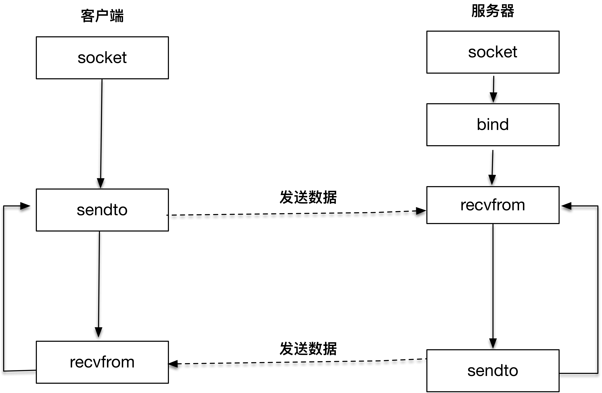

# Python-UDP

## 一.基本通信模型

创建一个基于udp的网络程序流程很简单，具体步骤如下：

1. 创建客户端套接字
2. 发送/接收数据
3. 关闭套接字



## 二.udp网络程序-发送数据

**结构：**

```python
from socket import *

# 1. 创建udp套接字
udp_socket = socket(AF_INET, SOCK_DGRAM)

# 2. 准备接收方的地址
# 表示目的ip地址
# port表示目的端口
dest_addr = (ip, port)  # 注意 是元组，ip是字符串，端口是数字

# 3. 从键盘获取数据
send_data = MSG

# 4. 发送数据到指定的电脑上的指定程序中
udp_socket.sendto(send_data.encode('utf-8'), dest_addr)

# 5. 关闭套接字
udp_socket.close()
```

demo:

```python
import socket


class UDPSender(object):
    def __init__(self, dest_addr: tuple):
        self.dest_addr = dest_addr  # 目标机器的IP地址和端口号
        self.ipv4_udp_socket = socket.socket(socket.AF_INET, socket.SOCK_DGRAM)

    def send_msg(self, msg: str):
        # 向指定地址发送信息
        self.ipv4_udp_socket.sendto(msg.encode(), self.dest_addr)

    def __del__(self):
        # 调用完成自动关闭socket
        self.ipv4_udp_socket.close()


if __name__ == '__main__':
    ip = "192.168.1.6"
    port = 8080

    udp_sender = UDPSender(dest_addr=(ip, port))
    msg = input("请输入要发送的信息:")
    udp_sender.send_msg(msg)
```

## 三.udp网络程序-接收数据

**结构：**

```python
from socket import *

# 1. 创建udp套接字
udp_socket = socket(AF_INET, SOCK_DGRAM)

# 2. 等待接收对方发送的数据
recv_data = udp_socket.recvfrom(1024)  # 1024表示本次接收的最大字节数

# 3.绑定端口
addr = (ip,port)
recv_data.bind(addr)

# 4. 显示对方发送的数据
# 接收到的数据recv_data是一个元组
# 第1个元素是对方发送的数据
# 第2个元素是对方的ip和端口
print(recv_data[0].decode('gbk'))
print(recv_data[1])

# 4. 关闭套接字
udp_socket.close()
```

demo:

```python
import socket


class UDPReceiver(object):
    def __init__(self, my_addr: tuple):
        self.ipv4_udp_socket = socket.socket(socket.AF_INET, socket.SOCK_DGRAM)
        self.ipv4_udp_socket.bind(my_addr)  # 绑定自己的ip地址和端口号

    def receive_msg(self):
        # 向指定地址发送信息
        rec_msg = self.ipv4_udp_socket.recvfrom(1024)  # 1024表示本次接收的最大字节数
        print(rec_msg)

    def __del__(self):
        # 调用完成自动关闭socket
        self.ipv4_udp_socket.close()


if __name__ == '__main__':
    ip = ""
    port = 8081
    udp_sender = UDPReceiver(my_addr=(ip, port))
    udp_sender.receive_msg()
```


