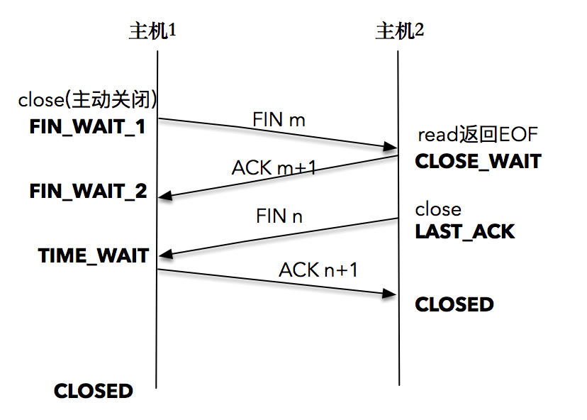

# TCP三次握手四次挥手

## 一.TCP三次握手

我们先看一下最初的过程，服务器端通过 socket，bind 和 listen 完成了被动套接字的准备工作，被动的意思就是等着别人来连接，然后调用 accept，就会阻塞在这里，等待客户端的连接来临；客户端通过调用 socket 和 connect 函数之后，也会阻塞。接下来的事情是由操作系统内核完成的，更具体一点的说，是操作系统内核网络协议栈在工作。

下面是具体的过程：

**第一次握手 - 客户端向服务器发送请求**：

- 客户端首先创建一个TCP报文段，其中包含一个随机的初始序列号（ISN）和设置SYN标志位（Synchronize）。
- 客户端将这个报文段发送给服务器。
- 客户端进入"SYN_SENT"状态，等待服务器的确认。

**第二次握手 - 服务器确认请求**：

- 服务器收到客户端的请求后，确认收到并接受连接请求。
- 服务器创建一个包含自己的随机序列号和SYN和ACK标志位（Acknowledgment）的TCP报文段，并将其发送给客户端。
- 服务器进入"SYN_RCVD"状态。

**第三次握手 - 客户端确认连接**：

- 客户端收到服务器的确认后，它也会创建一个包含自己的随机序列号和ACK标志位的TCP报文段，并将其发送给服务器。
- 客户端进入"ESTABLISHED"状态，而服务器在收到客户端的确认后也进入"ESTABLISHED"状态。
- 此时，TCP连接已经建立，客户端和服务器可以开始进行双向数据传输。

形象一点的比喻是这样的，有 A 和 B 想进行通话：

- A 先对 B 说：“喂，你在么？我在的，我的口令是 j。
- ”B 收到之后大声回答：“我收到你的口令 j 并准备好了，你准备好了吗？我的口令是 k。
- ”A 收到之后也大声回答：“我收到你的口令 k 并准备好了，我们开始吧。

”可以看到，这样的应答过程总共进行了三次，这就是 TCP 连接建立之所以被叫为“三次握手”的原因了。

## 二.TCP四次挥手

**第一次挥手 - 客户端通知服务器关闭连接**：

- 客户端首先决定要关闭连接，它会发送一个包含FIN标志位（Finish）的TCP报文段给服务器。
- 客户端进入"FIN_WAIT_1"状态，等待服务器的确认或拒绝。

**第二次挥手 - 服务器确认关闭请求**：

- 服务器收到客户端的FIN报文段后，确认关闭请求，并发送一个包含自己的FIN标志位的TCP报文段给客户端。
- 服务器进入"CLOSE_WAIT"状态，等待客户端的最后数据。

**第三次挥手 - 服务器通知客户端关闭连接**：

- 当服务器完成了它的数据传输任务后，会发送一个包含FIN标志位的TCP报文段给客户端，通知客户端可以关闭连接。
- 服务器进入"LAST_ACK"状态，等待客户端的确认。

**第四次挥手 - 客户端确认关闭请求**：

- 客户端收到服务器的FIN报文段后，确认关闭请求，并发送一个包含自己的ACK标志位的TCP报文段给服务器。
- 客户端进入"TIME_WAIT"状态，等待一段时间（通常是两个最大段寿命（Maximum Segment Lifetime，MSL）的时间）以确保所有重复的数据段都已被丢弃。
- 一旦等待时间过去，客户端关闭连接，进入"CLOSED"状态。

你可以看到，每个方向都需要一个 FIN 和一个 ACK，因此通常被称为四次挥手。

当然，这中间使用 shutdown，执行一端到另一端的半关闭也是可以的。当套接字被关闭时，TCP 为其所在端发送一个 FIN 包。在大多数情况下，这是由应用进程调用 close 而发生的，值得注意的是，一个进程无论是正常退出（exit 或者 main 函数返回），还是非正常退出（比如，收到 SIGKILL 信号关闭，就是我们常常干的 kill -9），所有该进程打开的描述符都会被系统关闭，这也导致 TCP 描述符对应的连接上发出一个 FIN 包。

无论是客户端还是服务器，任何一端都可以发起主动关闭。大多数真实情况是客户端执行主动关闭，你可能不会想到的是，HTTP/1.0 却是由服务器发起主动关闭的。