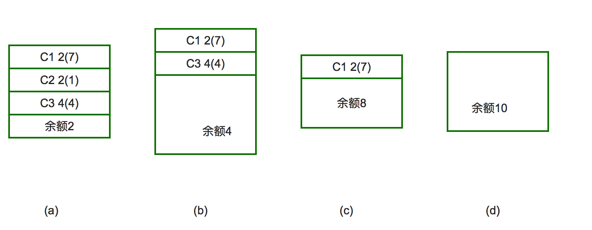

# 解决线程间分享数据存在的问题

## 一.同步

**概念**

同步就是协同步调，按预定的先后次序进行运行。如:你说完，我再说。

"同"字从字面上容易理解为一起动作

其实不是，"同"字应是指协同、协助、互相配合。

如进程、线程同步，可理解为进程或线程A和B一块配合，A执行到一定程度时要依靠B的某个结果，于是停下来，示意B运行;B执行，再将结果给A;A再继续操作。

## 二.解决线程同时修改全局变量的方式

对于上一小节提出的那个计算错误的问题，可以通过线程同步来进行解决

思路，如下:

1. 系统调用t1，然后获取到g_num的值为0，此时上一把锁，即不允许其他线程操作g_num
2. t1对g_num的值进行+1
3. t1解锁，此时g_num的值为1，其他的线程就可以使用g_num了，而且是g_num的值不是0而是1
4. 同理其他线程在对g_num进行修改时，都要先上锁，处理完后再解锁，在上锁的整个过程中不允许其他线程访问，就保证了数据的正确性

## 三.互斥锁

**当多个线程几乎同时修改某一个共享数据的时候，需要进行同步控制**

线程同步能够保证多个线程安全访问竞争资源，最简单的同步机制是引入互斥锁。

互斥锁为资源引入一个状态：锁定/非锁定

**某个线程要更改共享数据时，先将其锁定，此时资源的状态为“锁定”，其他线程不能更改；直到该线程释放资源，将资源的状态变成“非锁定”，其他的线程才能再次锁定该资源。互斥锁保证了每次只有一个线程进行写入操作，从而保证了多线程情况下数据的正确性。**

**结构：**

```
threading模块中定义了Lock类，可以方便的处理锁定：

# 创建锁
mutex = threading.Lock()

# 锁定
mutex.acquire()

# 释放
mutex.release()
```

> 注意：
>
> 如果这个锁之前是没有上锁的，那么acquire不会堵塞
>
> 如果在调用acquire对这个锁上锁之前 它已经被 其他线程上了锁，那么此时acquire会堵塞，直到这个锁被解锁为止

demo:

```python
import threading
import time

g_num = 0


def work1(num):
    global g_num

    for i in range(num):
        mutex.acquire()  # 加锁
        g_num += 1
        mutex.release()  # 解锁
    print("----in work1, g_num is %d---" % g_num)


def work2(num):
    global g_num
    for i in range(num):
        mutex.acquire()  # 加锁
        g_num += 1
        mutex.release()  # 解锁
    print("----in work2, g_num is %d---" % g_num)


if __name__ == '__main__':
    print("---线程创建之前g_num is %d---" % g_num)
    mutex = threading.Lock()  # 创建锁对象

    t1 = threading.Thread(target=work1, args=(1000000,))
    t1.start()

    t2 = threading.Thread(target=work2, args=(1000000,))
    t2.start()

    while len(threading.enumerate()) != 1:
        time.sleep(1)

    print("2个线程对同一个全局变量操作之后的最终结果是:%s" % g_num)

```

运行结果：

```
---线程创建之前g_num is 0---
----in work2, g_num is 1896045---
----in work1, g_num is 2000000---
2个线程对同一个全局变量操作之后的最终结果是:2000000
```

可以看到最后的结果，加入互斥锁后，其结果与预期相符。

**上锁解锁过程**

当一个线程调用锁的acquire()方法获得锁时，锁就进入“locked”状态。

每次只有一个线程可以获得锁。如果此时另一个线程试图获得这个锁，该线程就会变为“blocked”状态，称为“阻塞”，直到拥有锁的线程调用锁的release()方法释放锁之后，锁进入“unlocked”状态。

线程调度程序从处于同步阻塞状态的线程中选择一个来获得锁，并使得该线程进入运行（running）状态。

**总结**

锁的好处：

- 确保了某段关键代码只能由一个线程从头到尾完整地执行

锁的坏处：

- 阻止了多线程并发执行，包含锁的某段代码实际上只能以单线程模式执行，效率就大大地下降了
- 由于可以存在多个锁，不同的线程持有不同的锁，并试图获取对方持有的锁时，可能会造成死锁

##  四.死锁

在线程间共享多个资源的时候，如果两个线程分别占有一部分资源并且同时等待对方的资源，就会造成死锁。

尽管死锁很少发生，但一旦发生就会造成应用的停止响应。下面看一个死锁的例子

demo:

```python
import threading
import time


class MyThread1(threading.Thread):
    def run(self):
        # 对mutexA上锁
        mutexA.acquire()

        # mutexA上锁后，延时1秒，等待另外那个线程 把mutexB上锁
        print(self.name + '----do1---up----')
        time.sleep(1)

        # 此时会堵塞，因为这个mutexB已经被另外的线程抢先上锁了
        mutexB.acquire()
        print(self.name + '----do1---down----')
        mutexB.release()

        # 对mutexA解锁
        mutexA.release()


class MyThread2(threading.Thread):
    def run(self):
        # 对mutexB上锁
        mutexB.acquire()

        # mutexB上锁后，延时1秒，等待另外那个线程 把mutexA上锁
        print(self.name + '----do2---up----')
        time.sleep(1)

        # 此时会堵塞，因为这个mutexA已经被另外的线程抢先上锁了
        mutexA.acquire()
        print(self.name + '----do2---down----')
        mutexA.release()

        # 对mutexB解锁
        mutexB.release()


mutexA = threading.Lock()
mutexB = threading.Lock()

if __name__ == '__main__':
    t1 = MyThread1()
    t2 = MyThread2()
    t1.start()
    t2.start()
```

运行结果：

```
Thread-1----do1---up----Thread-2----do2---up----

```

此时已经进入到了死锁状态

## 五. 避免死锁

- 程序设计时要尽量避免（银行家算法）
- 添加超时时间等

## 六.银行家算法

[背景知识]

一个银行家如何将一定数目的资金安全地借给若干个客户，使这些客户既能借到钱完成要干的事，同时银行家又能收回全部资金而不至于破产，这就是银行家问题。这个问题同操作系统中资源分配问题十分相似：银行家就像一个操作系统，客户就像运行的进程，银行家的资金就是系统的资源。

[问题的描述]

一个银行家拥有一定数量的资金，有若干个客户要贷款。每个客户须在一开始就声明他所需贷款的总额。若该客户贷款总额不超过银行家的资金总数，银行家可以接收客户的要求。客户贷款是以每次一个资金单位（如1万RMB等）的方式进行的，客户在借满所需的全部单位款额之前可能会等待，但银行家须保证这种等待是有限的，可完成的。

例如：有三个客户C1，C2，C3，向银行家借款，该银行家的资金总额为10个资金单位，其中C1客户要借9各资金单位，C2客户要借3个资金单位，C3客户要借8个资金单位，总计20个资金单位。某一时刻的状态如图所示。



对于a图的状态，按照安全序列的要求，我们选的第一个客户应满足该客户所需的贷款小于等于银行家当前所剩余的钱款，可以看出只有C2客户能被满足：C2客户需1个资金单位，银行家手中的2个资金单位，于是银行家把1个资金单位借给C2客户，使之完成工作并归还所借的3个资金单位的钱，进入b图。同理，银行家把4个资金单位借给C3客户，使其完成工作，在c图中，只剩一个客户C1，它需7个资金单位，这时银行家有8个资金单位，所以C1也能顺利借到钱并完成工作。最后（见图d）银行家收回全部10个资金单位，保证不赔本。那麽客户序列{C1，C2，C3}就是个安全序列，按照这个序列贷款，银行家才是安全的。否则的话，若在图b状态时，银行家把手中的4个资金单位借给了C1，则出现不安全状态：这时C1，C3均不能完成工作，而银行家手中又没有钱了，系统陷入僵持局面，银行家也不能收回投资。

综上所述，银行家算法是从当前状态出发，逐个按安全序列检查各客户谁能完成其工作，然后假定其完成工作且归还全部贷款，再进而检查下一个能完成工作的客户，......。如果所有客户都能完成工作，则找到一个安全序列，银行家才是安全的。

