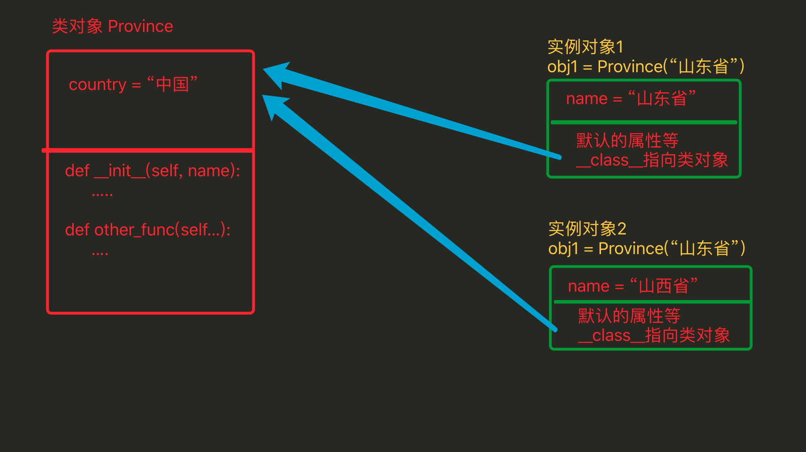

# 再论静态方法和类方法

## 一.类属性|实例属性

它们在定义和使用中有所区别，而最本质的区别是内存中保存的位置不同，

- 实例属性属于对象
- 类属性属于类

demo:

```python
class Province(object):
    # 类属性
    country = '中国'

    def __init__(self, name):
        # 实例属性
        self.name = name


# 创建一个实例对象
obj = Province('山东省')
# 直接访问实例属性
print(obj.name)
# 直接访问类属性
Province.country
```

> 由上述代码可以看出【实例属性需要通过对象来访问】【类属性通过类访问】
>
> 在使用上可以看出实例属性和类属性的归属是不同的。

其在内容的存储方式类似如下图：



由上图看出：

- 类属性在内存中只保存一份
- 实例属性在每个对象中都要保存一份

**应用场景：**

通过类创建实例对象时，如果每个对象需要具有相同名字的属性，那么就使用类属性，用一份即可

## 二.实例方法|静态方法|类方法

方法包括：实例方法、静态方法和类方法三种方法在内存中都归属于类，区别在于调用方式不同。

**实例方法:** 由对象调用；至少一个self参数；执行实例方法时，自动将调用该方法的对象赋值给self；

**类方法:** 由类调用； 至少一个cls参数；执行类方法时，自动将调用该方法的类赋值给cls；

**静态方法:** 由类调用；无默认参数；

demo实例方法:

```python
class Person(object):
    def foo(self):
        """
        实例方法
        :return:
        """
        print(id(self))  # 用来查看对象的id

    @staticmethod
    def static_foo():
        """
        静态方法
        :return:
        """
        pass

    @classmethod
    def class_foo(cls):
        """
        类方法
        :return:
        """


p1 = Person()
p2 = Person()
p1.foo()
p2.foo()
```

运行结果：

```
4481143248
4481143360
```

**静态方法：封装与类相关的工具方法**

demo:类方法和静态方法调用

```python
class Person(object):
    def foo(self):
        """
        实例方法
        :return:
        """
        print(id(self))  # 用来查看对象的id

    @staticmethod
    def static_foo():
        """
        静态方法
        :return:
        """
        print("in static")

    @classmethod
    def class_foo(cls):
        """
        类方法
        :return:
        """
        print("in class")


p1 = Person()
p2 = Person()
p1.foo()
p2.foo()

p1.static_foo()
p1.class_foo()

# 运行顺序 实例->类对象->类对象方法
# 可以使用__class__来调用类对象方法
p1.__class__.class_foo()
```

运行结果：

```
4329116224
4329116168
in static
in class
in class
```

> 对比
>
> 相同点：对于所有的方法而言，均属于类，所以 在内存中也只保存一份
>
> 不同点：方法调用者不同、调用方法时自动传入的参数不同。

