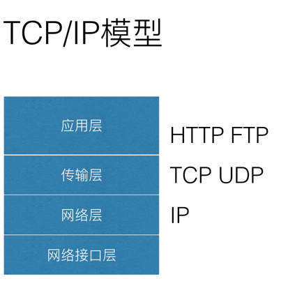
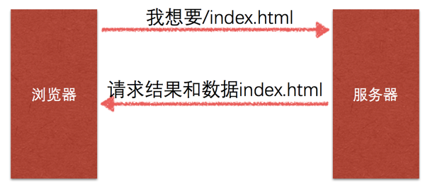

# HTTP协议

## 一.浏览器请求的基本流程


**基本过程：**

1. 用户输入网址.
2. 浏览器请求DNS服务器, 获取域名对应的IP地址.
3. 请求连接该IP地址服务器.
4. 发送资源请求. (HTTP协议)
5. web服务器接收到请求, 并解析请求, 判断用户意图.
6. 获取用户想要的资源.
7. 将资源返回给web服务器程序.
8. web服务器程序将资源数据通过网络发送给浏览器.
9. 浏览器解析请求的数据并且完成网页数据的显示.

> 域名是什么呢?

我们在访问一台服务器的时候，需要记住该服务器的IP地址，由于IP地址不利于人们记忆，所以推出的域名技术.。域名是由一串用点分隔的名字组成的Internet 上某一台计算机或计算机组的名称，用于在数据传输时标识计算机的位置。

域名可以用来表示一个单位、机构或可以利用个人在Internet上的确定的名称或位置。域名是惟一的，客户可以利用这个名字找寻有关的产品和服务信息。

> DNS 是什么呢？

由于我们用域名来标识计算机的位置，但是我们前面讲过，网络上标识主机的唯一标识是IP地址,，所以就需要记录一下，一个域名和IP地址的对应关系，这个对应关系就存储在DNS服务器中，当我们向DNS发出请求时，DNS会返回域名所对应的IP地址。

## 二.HTTP协议概述

### 2.1.HTTP协议简介

- 超文本传输协议（HyperText Transfer Protocol）是一种**应用层**协议。
- HTTP是万维网的数据通信的基础。设计HTTP最初的目的是为了提供一种发布和接收HTML页面<网页>的方法。

- 1989年蒂姆·伯纳斯-李在CERN研发
- 1999年公布现今广泛使用的HTTP 1.1版(RFC2616)

#### 2.1.1应用层



**从下到上每层的作用：**

**链路层(数据链路层/网络接口层):** 包括操作系统中的设备驱动程序、计算机中对应的网络接口卡。

**网络层:** 处理分组在网络中的活动,比如分组的选路.

**运输层:** 主要为两台主机上的应用提供端到端的通信.

**应用层:** 负责处理特定的应用程序细节.

#### 2.1.2请求－响应模式



### 2.2.使用浏览器分析通信过程和格式

这里介绍 谷歌开发者工具使用，Chrome 浏览器提供了一套完成的开发者工具, 很适合 web 开发者.

windows和Linux平台按F12调出开发者工具, MAC选择 视图 -> 开发者工具。


在 web 应用中，服务器把网页传给浏览器，实际就是把网页的 HTML 代码发送给浏览器，浏览器解析显示出来.。而浏览器和服务器之间的传输应用层协议就是 HTTP。所以:

- HTML 是一种用来定义网页的文本, 会 HTML 就可以编写网页.
- HTTP 是用来在网络上传输 HTML 文本的协议, 用于浏览器和服务器的通信.

- 元素(Elements):用于查看或修改HTML元素的属性、CSS属性、监听事件、断点等.
- 控制台(Console):控制台一般用于执行一次性代码, 查看JavaScript对象, 查看调试日志信息或异常信息.
- 源代码(Sources):该页面用于查看页面的HTML文件源代码、JavaScript源代码、CSS源代码, 此外最重要的是可以调试JavaScript源代码, 可以给JS代码添加断点等.
- 网络(Network):网络页面主要用于查看header等,与网络连接相关的信息.

> 注意:
>
>  Network 中的每一项就是一次请求/响应过程, 点击每一项, 可查看本次请求响应的报文信息.

## 三.HTTP 请求报文协议分析

Request Headers 中就是请求的报文数据内容。下面就是我们要请求的报文示例数据:

```
GET / HTTP/1.1
Host: localhost:10000
Connection: keep-alive
User-Agent: Mozilla/5.0 (Macintosh; Intel Mac OS X 10_13_3) AppleWebKit/537.36 (KHTML, like Gecko) Chrome/64.0.3282.186 Safari/537.36
Accept: text/html,application/xhtml+xml,application/xml;q=0.9,image/webp,image/apng,*/*;q=0.8
Accept-Encoding: gzip, deflate, br
Accept-Language: zh-CN,zh;q=0.9,en;q=0.8,zh-TW;q=0.7
```

### 3.1.请求行

`GET / HTTP/1.1` 叫做请求行。里面包含3个信息, 以空格隔开：

**请求方法:** 除了 GET 方法之外, 还有 POST 方法, 除此之外还有其他方法, 这两种最常用. GET 主要用于从服务器获得数据, POST 主要用于从浏览器提交数据到服务器. 比如像百度首页提供的上传图片的功能, 就是用POST方式.

**请求的资源路径:**  当请求的URL是 https://www.baidu.com/，那么我们会发现 路径会显示 '/'，那么如果请求的URL是 https://www.baidu.com/index.html，我们会发现路径显示是 '/index.html'。

 **HTTP协议的版本:** 那么既然有 1.1版本， 前置版本肯定是1.0了

> 那么两个版本有什么区别呢? 
>
> 1.1版本比1.0的版本主要多个一些请求方法等扩充协议的内容.

### 3.2.请求头

除了第一行之外, 剩下的所有数据的格式都是类似的。

**Host:** 表示浏览器要请求的主机地址。这是我们查看下 baidu.com， 请求不同的网站，会有不同的主机地址。

**Connection:** 表示浏览器和服务器之间的连接方式，浏览器和服务器连接是长连接还是短连接。

**User-Agent:** 用户代理,，我们使用谷歌浏览器和火狐浏览器分别请求百度，那么会发现 User-Agent 的值是不一样的，它主要是用于浏览器告诉服务器自己的身份，比如浏览器端使用的操作系统是什么版本，浏览器是什么版本等等。

> 服务器端为什么需要知道这个信息呢? 
>
> 我们后面会讲到爬虫，爬虫程序主要是从服务器端获取数据，那么服务器端就会有反爬机制，服务器不希望爬虫来获取数据，所以通过该项可以知道客户端是否是爬虫程序。如果爬虫程序想伪装成一个浏览器的请求, 就必须设置此项.

**Accept:** 表示浏览器告诉服务器，自己能够接收并识别的文件类型。

**Accept-Encoding:** 表示浏览器能够处理的压缩方式。

> 为什么需要压缩呢？ 
>
> 当网页数据量大的时候，压缩之后可以提高传输速率，提高用户体验。

**Accept-Language:** 浏览器可以接收的文本语言，如果非中文编码可能会出现乱码。

### 3.3.请求报文格式总结

| 格式   | 内容                                                    |
| ------ | ------------------------------------------------------- |
| 请求行 | 请求方法 资源路径 HTTP版本\r\n    eg:GET / HTTP/1.1\r\n |
| 请求头 | 头名称:头对应的值\r\n  eg:Host:localhost:1000/r/n       |
| 空行   | \r\n                                                    |
| 请求体 | 1.name=abc&age=80 2.二进制数据(例如上传图片)            |

## 四.HTTP 响应报文协议分析

```
HTTP/1.1 200 OK
Connection: Keep-Alive
Content-Encoding: gzip
Content-Type: text/html; charset=utf-8
Date: Wed, 14 Mar 2018 09:52:48 GMT
Server: BWS/1.1
```

### 4.1.响应行

`HTTP/1.1 200 OK` 叫做响应行, 共分成3部分

**HTTP协议的版本:** HTTP/1.1 表示 HTTP协议的版本。

**响应状态码:** 200 这个数字表示响应状态码，用户向服务器发出了请求，如果服务器正常返回响应报文，那么状态码一般都是200。

**状态码的简单描述:**  "OK" 表示原因短语, 表示对前面状态码的简单描述.

> **常见的状态码:**
>
> **302 redirect:** 我们通过 302 状态码可以指示浏览器跳转到某一个 URL。
>
> **404 NOT FOUND:** 当我们访问一个不存在的 URL 时，一般会返回404 状态码，告诉浏览器，你访问的 URL 是不存在的。
>
> **500 Internal Server Error:** 服务器遇到了一个未曾预料的状况，导致了它无法完成对请求的处理。 一般来说, 这个问题都会在服务器端的源代码出现错误时出现.

### 4.2.响应头

第二行下面的所有内容，我们叫做响应头。

 **Content-Type:** 表示响应内容的文本格式和编码方式。

### 4.3.响应报文格式总结

| 格式     | 内容                                                         |
| -------- | ------------------------------------------------------------ |
| 响应行   | HTTP版本 状态码 原因短语\r\n   eg:HTTP/1.1 200 OK\r\n        |
| 响应头   | 头名称:头对应的值\r\n  eg:Content-Type: text/html; charset=utf-8 |
| 空行     | \r\n                                                         |
| 响应内容 | Hello world                                                  |

## 五.长连接短连接

在HTTP/1.0中， 默认使用的是短连接。也就是说浏览器和服务器每进行一次HTTP操作，就建立一次连接，当任务结束就中断连接。如果客户端浏览器访问的某个HTML或其他类型的 Web 页中包含有其他的Web资源，如js文件、图像文件、CSS文件等；当浏览器每遇到这样一个Web资源，就会建立一个HTTP会话。

从 HTTP/1.1起，默认使用长连接，用以保持连接特性。使用长连接的HTTP协议，会在响应头有加入这行代码:

```
Connection:keep-alive
```

### 5.1.长连接过程

在真正的读写操作之前，server与client之间必须建立一个连接，

当读写操作完成后，双方不再需要这个连接时它们可以释放这个连接，

连接的建立通过三次握手，释放则需要四次握手，

所以说每个连接的建立都是需要资源消耗和时间消耗的。

